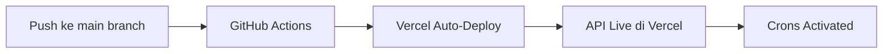

# API Hari Libur Indonesia 🇮🇩

[](https://api-hari-libur.vercel.app)
[](LICENSE)

REST API untuk data hari libur nasional dan cuti bersama Indonesia. Data otomatis di-update setiap bulan menggunakan web scraping dari [tanggalan.com](https://www.tanggalan.com/).

## 🚀 Fitur

- ✅ **Data Terkini**: Otomatis update setiap tanggal 1 bulan
- ✅ **Simple REST API**: Endpoint yang mudah digunakan
- ✅ **Dual Scheduling**: Local node-cron + Vercel crons
- ✅ **Manual Trigger**: Bisa generate data on-demand
- ✅ **Comprehensive Logging**: Semua proses tercatat
- ✅ **Production Ready**: Deployed di Vercel dengan auto-scaling

## 🔗 Demo

API Live: **[https://api-hari-libur.vercel.app/api?year=2026](https://api-hari-libur.vercel.app/api?year=2026)**

Coba di browser atau gunakan curl:
```bash
curl "https://api-hari-libur.vercel.app/api?year=2026"
```

## 📦 Installation

### Local Development

```bash
# Clone repository
git clone https://github.com/andifahruddinakas/api-hari-libur.git
cd api-hari-libur

# Install dependencies
npm install

# Run server
node index.js
```

Server akan berjalan di `http://localhost:5000`

### Production (Vercel)

Deployment otomatis ketika push ke branch `main`. Vercel akan:
1. Build project
2. Deploy serverless functions
3. Activate Vercel Crons
4. Expose API di Vercel domain

## 📚 API Documentation

### 1️⃣ Get Holidays

Mengambil data hari libur berdasarkan tahun dan bulan.

**Endpoint:**
```
GET /api
```

**Query Parameters:**
| Parameter | Type | Required | Default | Deskripsi |
|-----------|------|----------|---------|-----------|
| `year` | number | ✗ | Tahun saat ini | Tahun yang diinginkan (2020-2030+) |
| `month` | number | ✗ | - | Bulan spesifik (1-12) |

**Examples:**

```bash
# Semua hari libur 2026
curl "https://api-hari-libur.vercel.app/api?year=2026"

# Hari libur Januari 2026
curl "https://api-hari-libur.vercel.app/api?year=2026&month=1"

# Hari libur tahun saat ini
curl "https://api-hari-libur.vercel.app/api"
```

**Response (Success - 200):**
```json
{
  "status": "success",
  "code": 200,
  "data": [
    {
      "date": "2026-01-01",
      "description": "Tahun Baru 2026 Masehi"
    },
    {
      "date": "2026-01-16",
      "description": "Isra' Mi'raj Nabi Muhammad SAW"
    }
  ],
  "message": "Holidays Found"
}
```

**Response (Not Found - 404):**
```json
{
  "status": "error",
  "code": 404,
  "data": null,
  "message": "Not Found"
}
```

---

### 2️⃣ Manual Generate Data

Trigger generation data hari libur untuk tahun spesifik (manual).

**Endpoint:**
```
POST /api/generate
```

**Request Body:**
```json
{
  "year": 2027
}
```

**Examples:**

```bash
curl -X POST "https://api-hari-libur.vercel.app/api/generate" \
  -H "Content-Type: application/json" \
  -d '{"year": 2027}'
```

**Response (Success - 200):**
```json
{
  "status": "success",
  "code": 200,
  "data": {
    "year": 2027
  },
  "message": "Data untuk tahun 2027 berhasil disimpan."
}
```

**Response (Server Error - 500):**
```json
{
  "status": "error",
  "code": 500,
  "data": null,
  "message": "Error: network timeout"
}
```

---

### 3️⃣ Scheduler Info

Mendapatkan informasi status scheduler dan jadwal otomatis.

**Endpoint:**
```
GET /api/scheduler/info
```

**Examples:**

```bash
curl "https://api-hari-libur.vercel.app/api/scheduler/info"
```

**Response:**
```json
{
  "status": "success",
  "code": 200,
  "data": {
    "status": "active",
    "schedule": "0 2 1 * * (setiap tanggal 1 bulan jam 02:00 pagi)",
    "nextRun": "Akan dijalankan pada tanggal 1 bulan depan",
    "lastUpdate": "2026-02-04T13:37:12.000Z"
  },
  "message": "Scheduler is running"
}
```

---

## ⏰ Automatic Scheduling

Data hari libur otomatis di-generate setiap bulan tanpa perlu intervensi manual.

### Schedule Configuration

**Cron Expression:** `0 2 1 * *`

**Arti:** 
- `0` = Menit ke-0
- `2` = Jam ke-2 (02:00)
- `1` = Tanggal 1
- `*` = Setiap bulan
- `*` = Setiap hari dalam minggu

**Waktu Eksekusi:** Tanggal 1 setiap bulan, pukul 02:00 UTC

### Dual Scheduling System

| Lokasi | Scheduler | Status | Catatan |
|--------|-----------|--------|---------|
| **Local Development** | Node-Cron | ✅ Aktif | Memakai CPU lokal, berjalan saat server jalan |
| **Production (Vercel)** | Vercel Crons | ✅ Aktif | Terkelola Vercel, 100% uptime, zero cost |

### Behavior

Setiap tanggal 1 bulan, sistem akan:
1. ✅ Generate data hari libur untuk tahun saat ini
2. ✅ Generate data untuk tahun depan (jika bulan ≥ Oktober)
3. ✅ Simpan file JSON di folder `data/`
4. ✅ Log semua proses untuk monitoring
5. ✅ Handle error gracefully (scheduler tetap aktif)

### Monitoring

**Local:**
```bash
# Output di console
[SCHEDULER] Scheduled task telah diaktifkan
[SCHEDULER] Generator akan berjalan otomatis setiap tanggal 1 bulan jam 02:00 pagi
[2026-02-01T02:00:00.000Z] Menjalankan scheduled generation...
```

**Production (Vercel):**
1. Buka dashboard: https://vercel.com/dashboard
2. Select project `api-hari-libur`
3. Tab **Functions** atau **Cron Jobs**
4. Lihat execution history & logs

---

## 📁 Project Structure

```
api-hari-libur/
├── api/
│   └── generate-holiday.js        # Vercel Cron handler
├── data/
│   ├── 2020.json
│   ├── 2021.json
│   ├── 2022.json
│   ├── 2023.json
│   ├── 2024.json
│   ├── 2025.json
│   └── 2026.json                  # Data terbaru
├── generator/
│   ├── index.js                   # Web scraper logic
│   └── package.json
├── public/
│   └── index.html                 # Landing page
├── index.js                       # Main Express server
├── scheduler.js                   # Node-cron scheduler
├── package.json
├── vercel.json                    # Vercel config + crons
├── README.md                      # This file
├── SCHEDULER_GUIDE.md             # Detailed scheduler docs
├── VERCEL_CRONS.md                # Vercel crons documentation
└── IMPLEMENTATION_SUMMARY.md      # Implementation details
```

---

## 🛠️ Development

### Prerequisites

- Node.js >= 14.x
- npm atau yarn

### Setup

```bash
# Install dependencies
npm install

# Run development server
node index.js

# Server akan berjalan di port 5000
# Akses: http://localhost:5000/api?year=2026
```

### Environment Variables

```bash
# .env (optional)
PORT=5000                # Default: 5000
NODE_ENV=development     # development | production
```

### Testing Endpoints Locally

```bash
# Get holidays 2026
curl "http://localhost:5000/api?year=2026"

# Get holidays Januari 2026
curl "http://localhost:5000/api?year=2026&month=1"

# Manual generate 2027
curl -X POST "http://localhost:5000/api/generate" \
  -H "Content-Type: application/json" \
  -d '{"year": 2027}'

# Check scheduler info
curl "http://localhost:5000/api/scheduler/info"
```

---

## 📊 Data Format

Setiap file JSON berisi array hari libur dengan struktur:

```json
[
  {
    "date": "2026-01-01",
    "description": "Tahun Baru 2026 Masehi"
  },
  {
    "date": "2026-01-16",
    "description": "Isra' Mi'raj Nabi Muhammad SAW"
  }
]
```

**Tipe Data:**
- `date` (string): Format ISO 8601 `YYYY-MM-DD`
- `description` (string): Nama/deskripsi hari libur

---

## 📝 Dokumentasi Lengkap

Dokumentasi detailed tersedia dalam file-file berikut:

- **[SCHEDULER_GUIDE.md](./SCHEDULER_GUIDE.md)** - Panduan lengkap sistem scheduler
- **[VERCEL_CRONS.md](./VERCEL_CRONS.md)** - Dokumentasi Vercel Crons integration
- **[IMPLEMENTATION_SUMMARY.md](./IMPLEMENTATION_SUMMARY.md)** - Summary teknis implementasi

---

## 🔄 Data Source

Data hari libur bersumber dari: [**https://www.tanggalan.com/**](https://www.tanggalan.com/)

**Update Frequency:** Otomatis setiap tanggal 1 bulan pukul 02:00 UTC

**Coverage:** Indonesia (nasional)

---

## 🚀 Deployment

### Automatic Deployment (GitHub + Vercel)



1. Push code ke branch `main`
2. Vercel otomatis detect changes
3. Deploy serverless functions
4. Crons configuration activated
5. API siap digunakan

### Manual Deployment

Tidak perlu, karena GitHub + Vercel integration sudah otomatis.

---

## ⚠️ Limitations & Notes

- **Data Accuracy**: Data bersumber dari tanggalan.com, accuracy tergantung source
- **Timezone**: Scheduler menggunakan UTC timezone
- **Network Dependency**: Perlu koneksi internet untuk scraping data
- **Rate Limiting**: Tanggalan.com mungkin punya rate limiting
- **Data Storage**: File JSON disimpan di Vercel serverless filesystem (persisten)

---

## 🤝 Contributing

Kontribusi welcome! Untuk berkontribusi:

1. Fork repository
2. Create feature branch (`git checkout -b feature/AmazingFeature`)
3. Commit changes (`git commit -m 'Add some AmazingFeature'`)
4. Push ke branch (`git push origin feature/AmazingFeature`)
5. Open Pull Request

---

## 📄 License

ISC License - lihat file [LICENSE](LICENSE)

---

## ☕ Support

Jika project ini membantu Anda, consider untuk:

<a href="https://saweria.co/andifahruddinakas" target="_blank">
  
</a>

---

## 📧 Contact

- **Author**: [@andifahruddinakas](https://github.com/andifahruddinakas)
- **Issues**: [GitHub Issues](https://github.com/andifahruddinakas/api-hari-libur/issues)
- **Discussions**: [GitHub Discussions](https://github.com/andifahruddinakas/api-hari-libur/discussions)

---

## 📈 Status

| Komponen | Status |
|----------|--------|
| **API** | ✅ Operational |
| **Scheduler (Local)** | ✅ Running |
| **Scheduler (Vercel)** | ✅ Active |
| **Data 2026** | ✅ Available |
| **Data 2025** | ✅ Available |
| **Data 2024** | ✅ Available |

---

**Last Updated:** February 2026  
**Status:** Production Ready ✅
